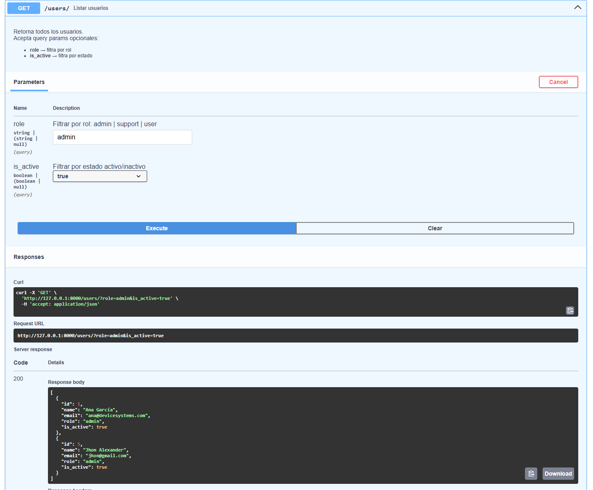
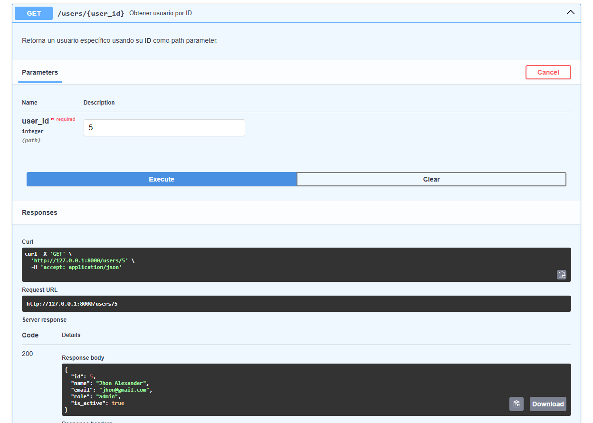
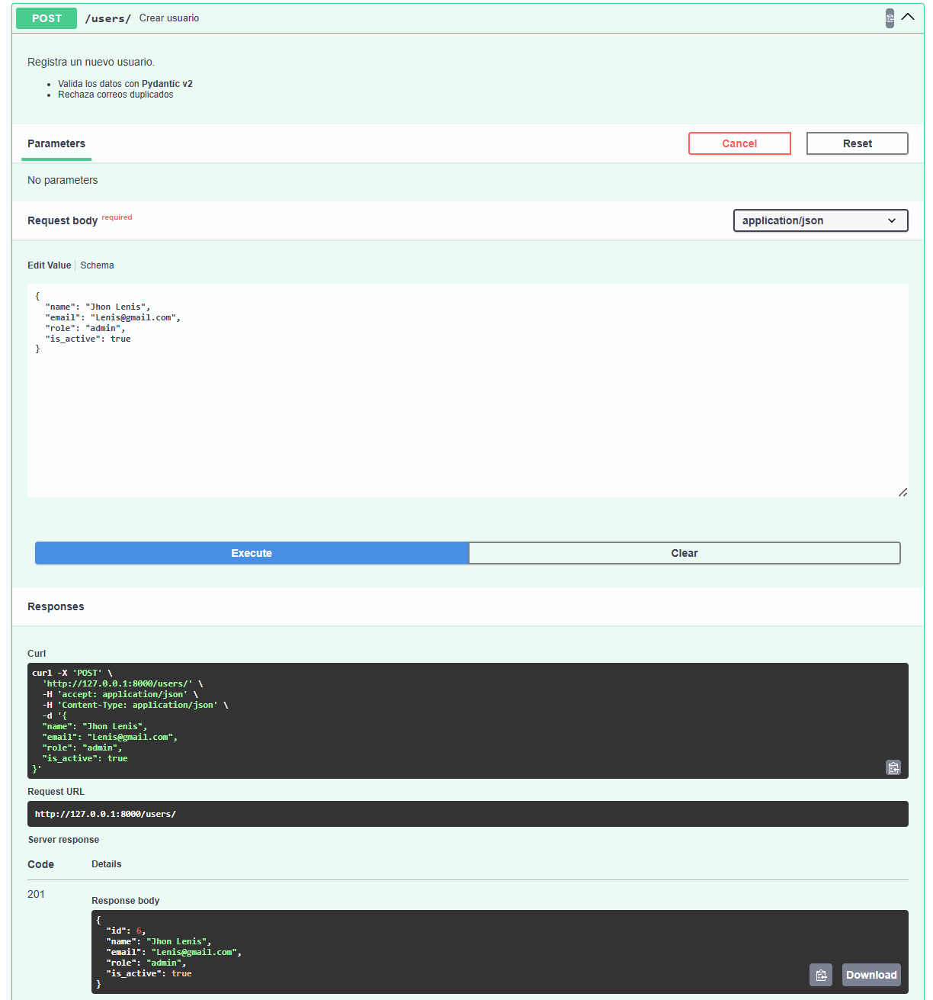
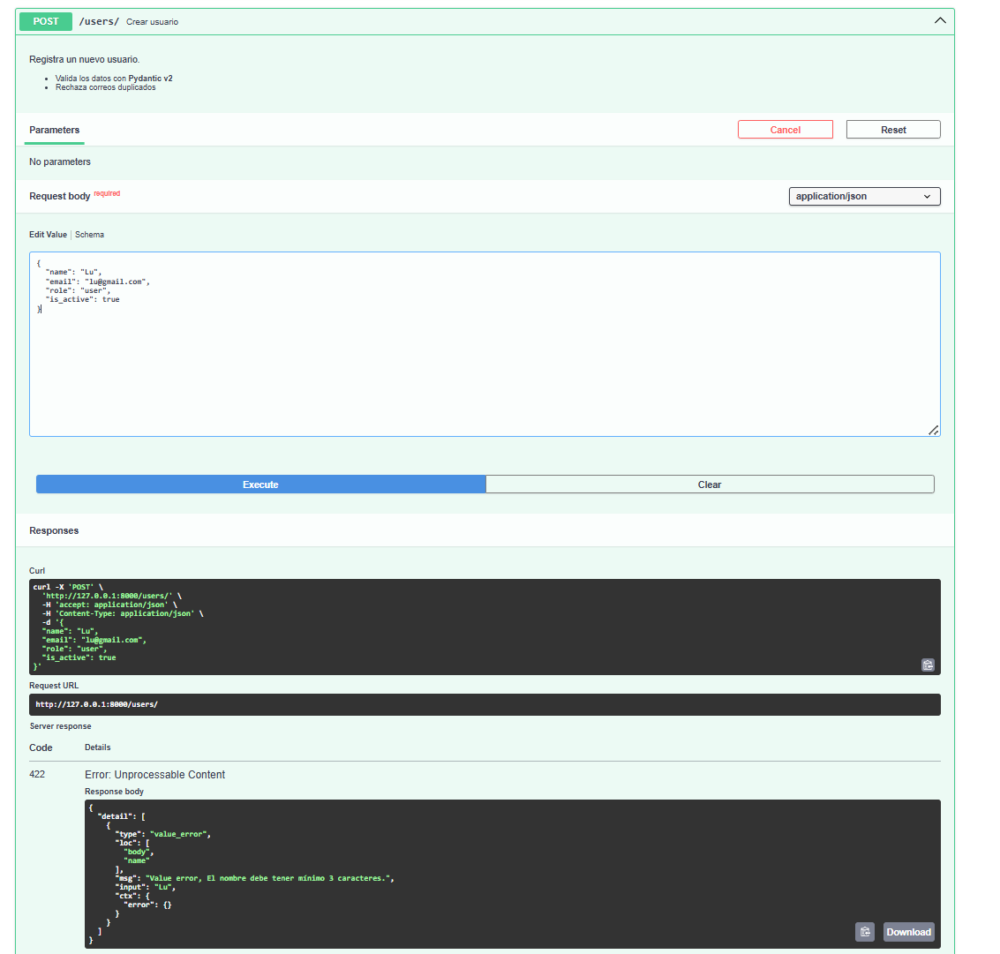
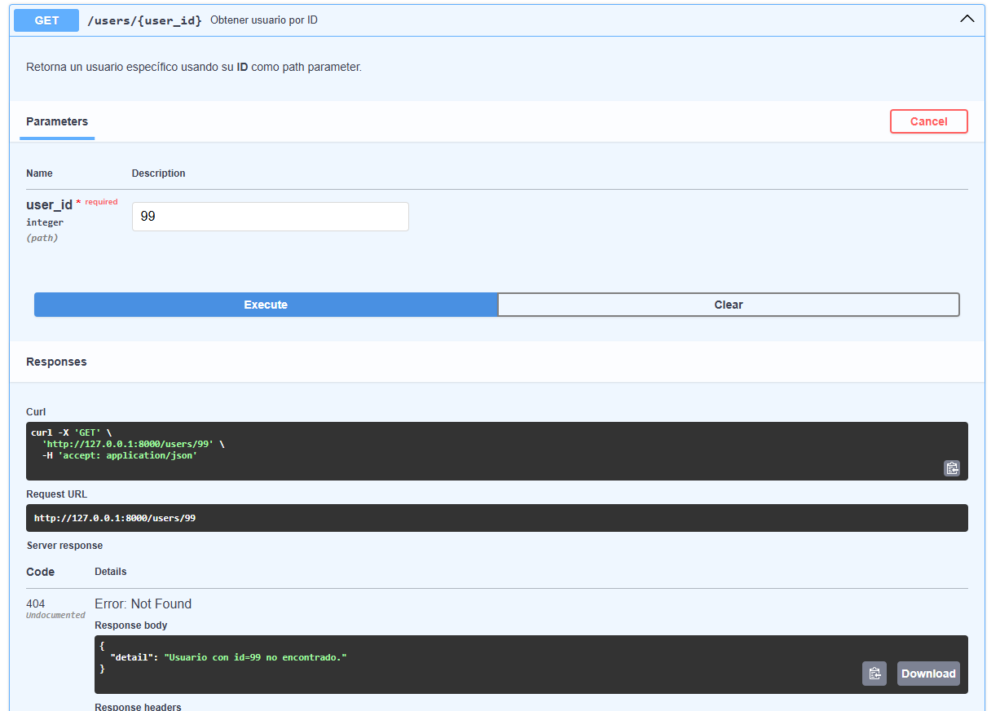

#  device_systems — API REST de Usuarios

Proyecto desarrollado con **FastAPI** como parte de la actividad.
La API permite gestionar usuarios del sistema: consultarlos, filtrarlos y registrar nuevos, todo con validación automática de datos.

---

##  ¿Cómo poner en marcha el proyecto?

**1. Instala las dependencias:**

```bash
pip install -r requirements.txt
```

**2. Arranca el servidor:**

```bash
uvicorn app.main:app --reload
```

**3. Abre la documentación en tu navegador:**

```
http://127.0.0.1:8000/docs
```

---

##  Endpoints disponibles

| Método | Ruta                    | ¿Para qué sirve?                    |
|--------|-------------------------|--------------------------------------|
| GET    | `/users`                | Ver todos los usuarios               |
| GET    | `/users?role=admin`     | Filtrar por rol                      |
| GET    | `/users?is_active=true` | Filtrar por estado activo/inactivo   |
| GET    | `/users/{id}`           | Buscar un usuario por su ID          |
| POST   | `/users`                | Registrar un usuario nuevo           |

> Todas las respuestas incluyen las cabeceras `X-App-Name: device_systems` y `X-API-Version: 1.0`

---

##  ¿Cómo es un usuario en el sistema?

Cada usuario tiene estos campos:

| Campo       | Tipo    | Regla                                          |
|-------------|---------|------------------------------------------------|
| `id`        | número  | Se genera automáticamente                      |
| `name`      | texto   | Obligatorio, mínimo 3 caracteres               |
| `email`     | texto   | Debe tener formato válido y no estar repetido  |
| `role`      | texto   | Solo puede ser: `admin`, `support` o `user`    |
| `is_active` | sí/no   | `true` si está activo, `false` si no           |

---

##  Evidencias en Swagger UI

###  GET /users — Metodo Get

>  


---

### ✅ GET /users/{id} — Buscar Usuario

>  

---


###  POST /users — Registrar un usuario nuevo

El body que se envía:

```json
{
  "name": "Jhon Alexander",
  "email": "jhon@gmail.com",
  "role": "admin",
  "is_active": true
}
```

>  

---

###  Validaciones y errores

**Error 422 — nombre muy corto** (menos de 3 caracteres):

>  

---


**Error 404 — Obtener Usuario:**

> 

---

##  Video de sustentación

📽️ **Enlace del video:**

> https://youtu.be/I1YIeUaekzw

---

## 💬 Reflexión — ¿Qué aprendí usando FastAPI?

FastAPI fue el primer framework de backend que usé y la verdad me sorprendió lo fácil que fue empezar. En pocos pasos ya tenía el servidor corriendo y podía ver mis endpoints funcionando directamente en el navegador con Swagger.
Lo que más me gustó fue que no tuve que preocuparme por validar los datos manualmente. Con Pydantic solo defines los campos del modelo y automáticamente te avisa si algo está mal, como un correo sin @ o un nombre muy corto. Eso me ahorró mucho código.
También entendí para qué sirven los diferentes métodos HTTP. El GET para consultar información y el POST para enviar datos nuevos. Al principio sonaban igual pero con la práctica quedó claro que cada uno tiene su propósito.
Si tuviera que resumirlo en una frase: FastAPI hace que construir una API no se sienta complicado, y eso motiva a seguir aprendiendo.