# Device Systems API

## GA1-220501096-01-AA1-EV09
### FastAPI con SQLAlchemy: Persistencia de Datos y CRUD sobre Base de Datos

---

# Integrante

- Jhon Alexander Lenis Holguín
---

# Descripción del Proyecto

Device Systems API es una aplicación desarrollada con FastAPI que implementa operaciones CRUD para la gestión de usuarios utilizando persistencia de datos mediante SQLAlchemy y PostgreSQL alojado en Neon Tech.

El proyecto permite:

- Crear usuarios.
- Consultar usuarios.
- Buscar usuarios por ID.
- Filtrar usuarios por rol.
- Actualizar usuarios.
- Eliminar usuarios.
- Validar datos con Pydantic.
- Gestionar errores controlados.
- Documentar automáticamente la API mediante Swagger UI.

---

# Tecnologías Utilizadas

- Python 3
- FastAPI
- SQLAlchemy
- Pydantic v2
- PostgreSQL
- Neon Tech
- Uvicorn
- Swagger/OpenAPI

---

# Estructura del Proyecto

La aplicación fue organizada siguiendo la arquitectura propuesta en la guía de aprendizaje.


---

# Base de Datos Generada

Se utilizó PostgreSQL mediante Neon Tech para almacenar la información de manera persistente.

### Base de datos en Neon Tech


### Tabla actualizada con registros

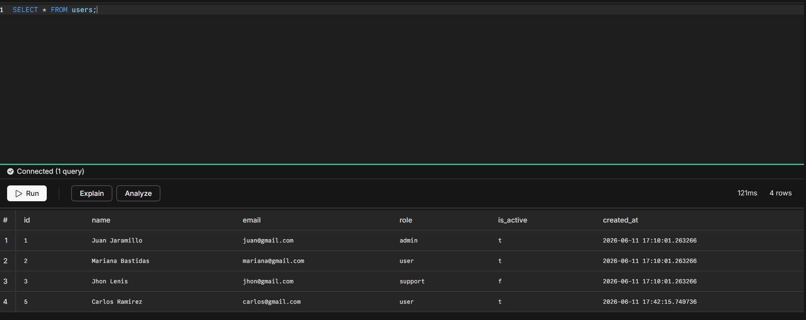

---

# Documentación Swagger UI

FastAPI genera automáticamente la documentación interactiva de la API.

Ruta:

```text
http://127.0.0.1:8000/docs
```

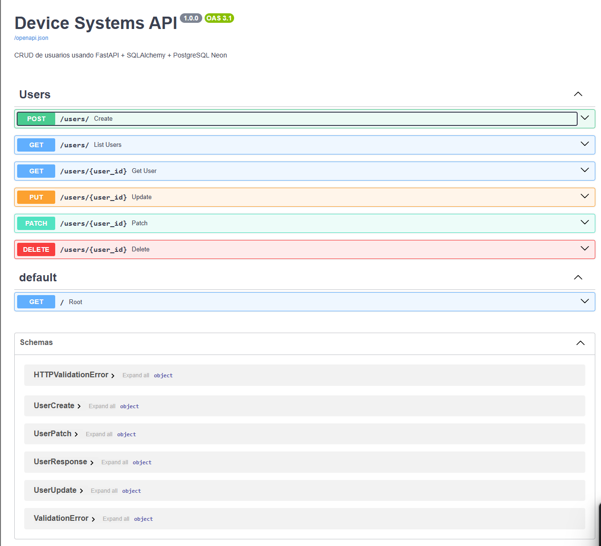

---

# Evidencia de Pruebas de los Endpoints

## Crear Usuario

Endpoint:

```http
POST /users/
```

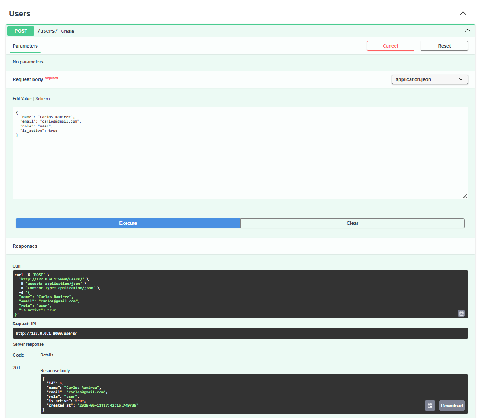

---

## Listar Usuarios

Endpoint:

```http
GET /users/
```

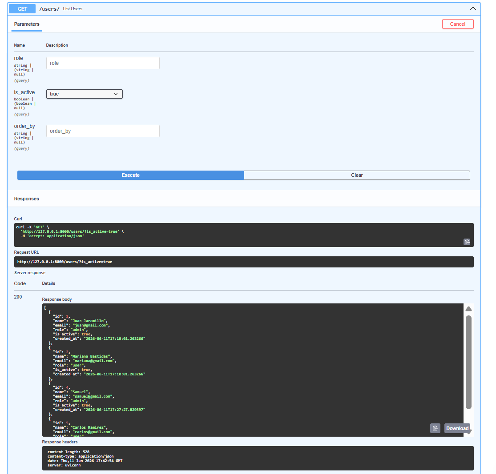

---

## Buscar Usuario por ID

Endpoint:

```http
GET /users/{user_id}
```

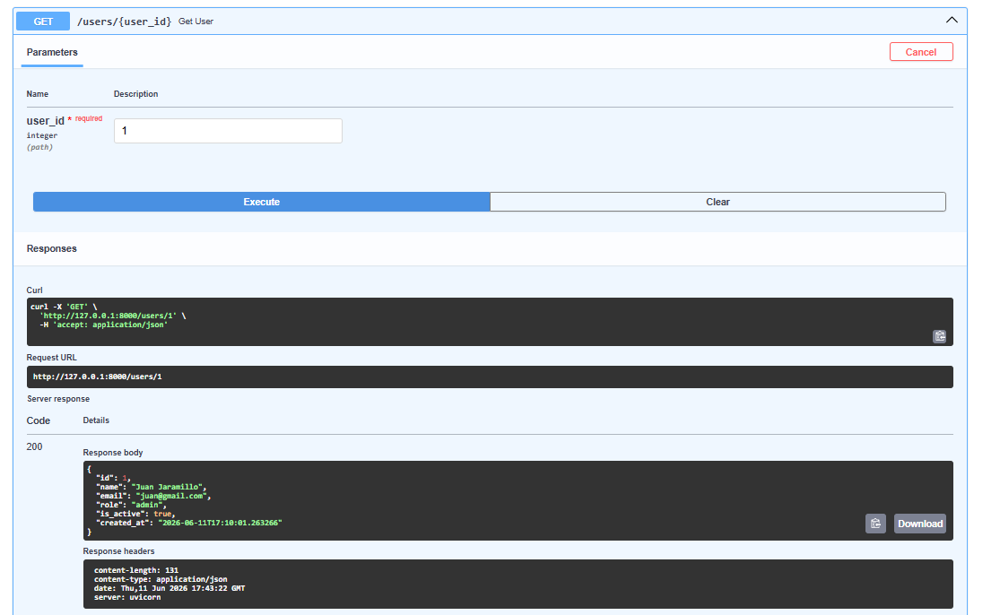

---

## Filtrar Usuarios por Rol

Endpoint:

```http
GET /users/?role=admin
```

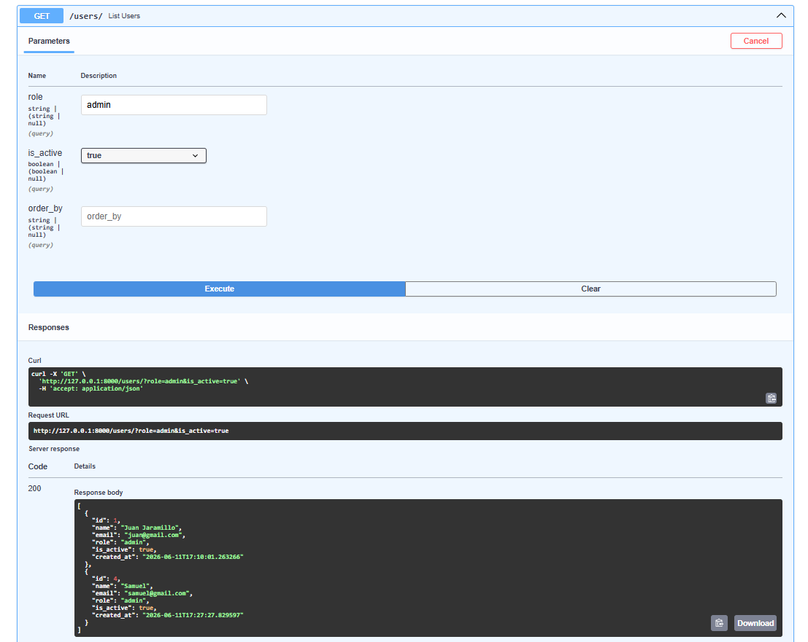

---

## Actualizar Usuario Completo

Endpoint:

```http
PUT /users/{user_id}
```

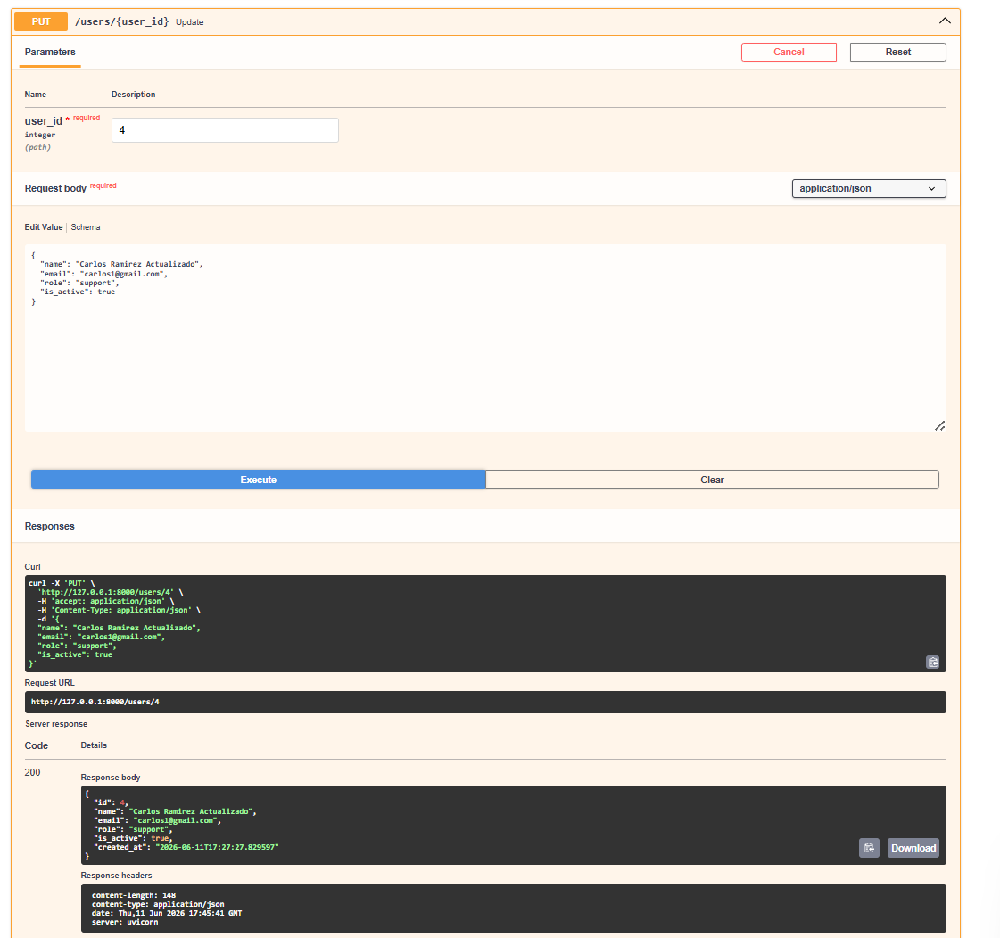

---

## Actualización Parcial

Endpoint:

```http
PATCH /users/{user_id}
```

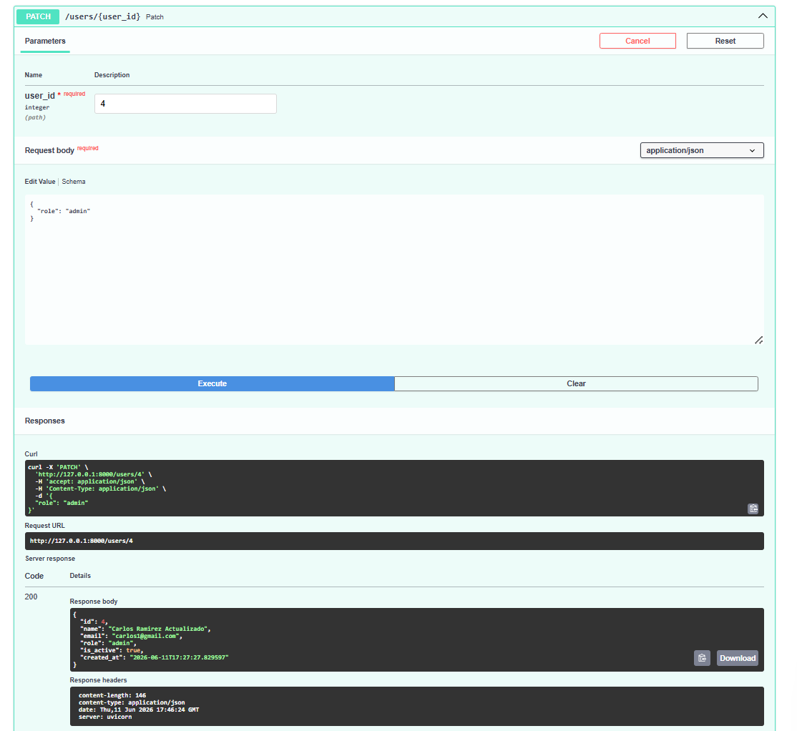

---

## Eliminar Usuario

Endpoint:

```http
DELETE /users/{user_id}
```

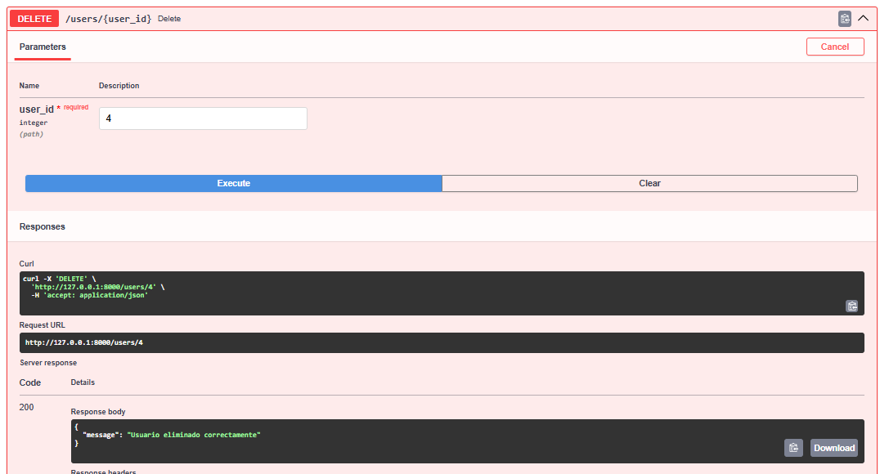

---

# Evidencia de Errores Controlados

La aplicación implementa manejo de errores utilizando excepciones HTTP y validaciones de Pydantic.

---

## Error por Email Duplicado

Código esperado:

```http
400 Bad Request
```

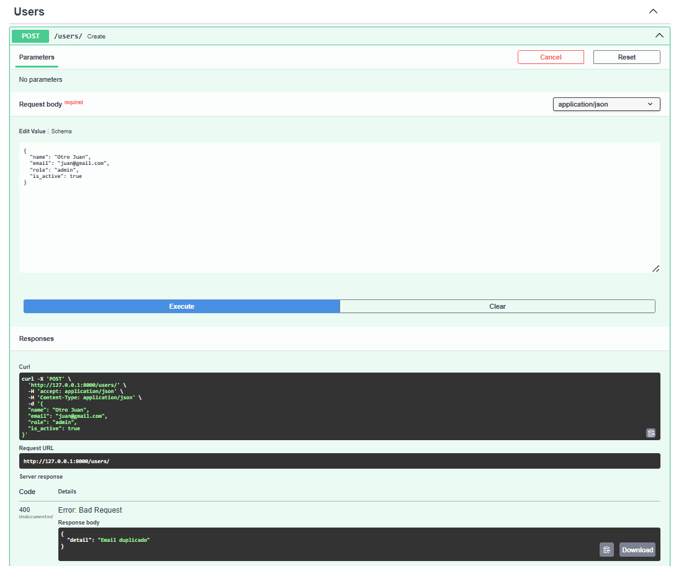

---

## Usuario No Encontrado

Código esperado:

```http
404 Not Found
```

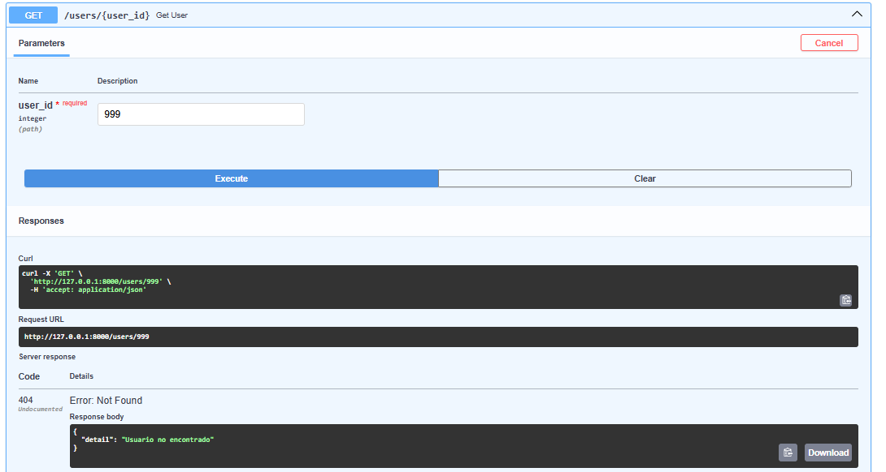

---

## Correo Electrónico Inválido

Código esperado:

```http
422 Unprocessable Entity
```

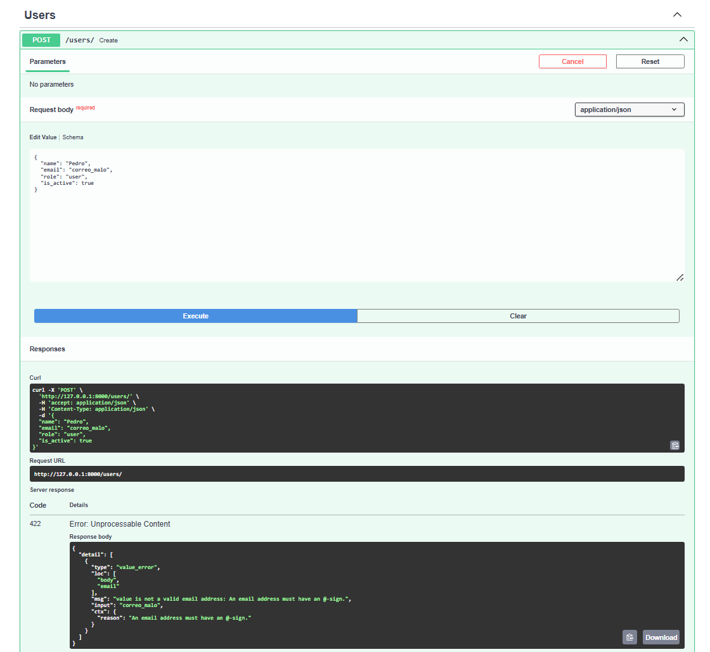

---

## Rol No Permitido

Código esperado:

```http
422 Unprocessable Entity
```

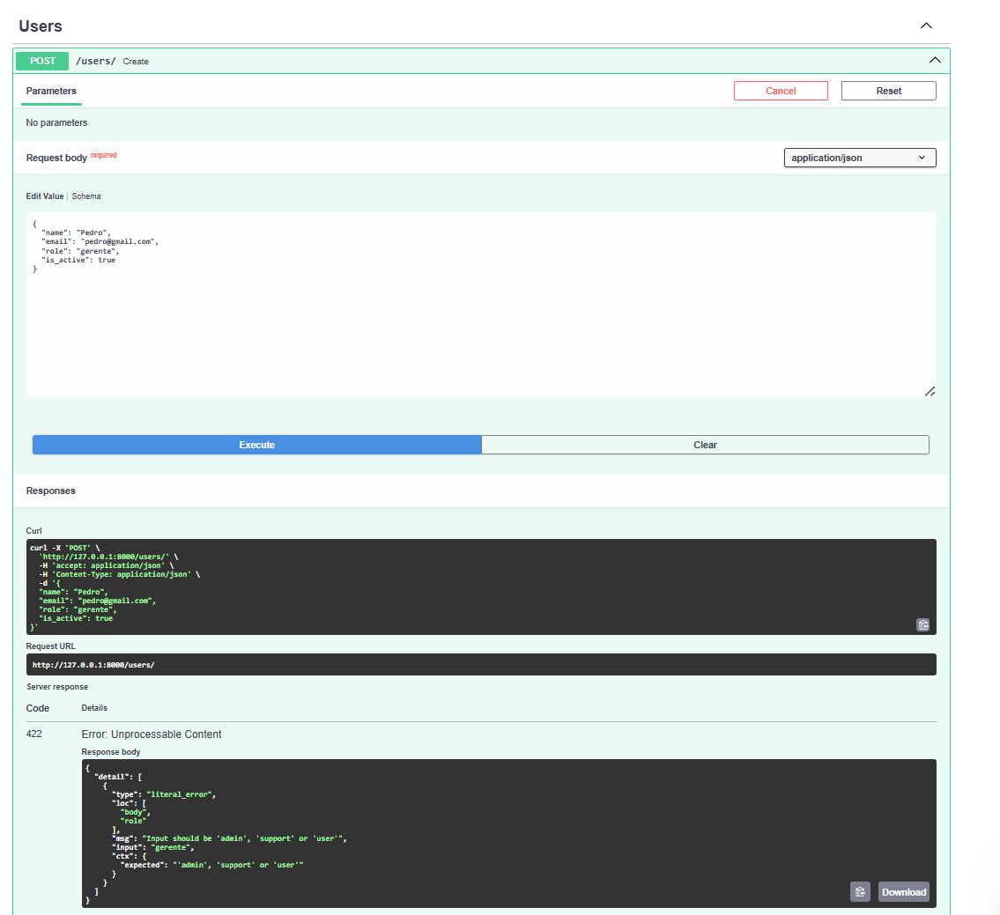

---

# Diferencia entre Modelo SQLAlchemy y Schema Pydantic

## Modelo SQLAlchemy

Los modelos SQLAlchemy representan las tablas de la base de datos.

Su función principal es:

- Crear tablas.
- Definir columnas.
- Establecer restricciones.
- Realizar consultas CRUD.
- Gestionar la persistencia de los datos.

Ejemplo:

```python
class User(Base):
    __tablename__ = "users"

    id = Column(Integer, primary_key=True)
    name = Column(String)
    email = Column(String, unique=True)
```

---

## Schema Pydantic

Los schemas Pydantic representan los datos de entrada y salida de la API.

Su función principal es:

- Validar información.
- Garantizar tipos de datos correctos.
- Definir respuestas.
- Controlar los datos enviados por el cliente.

Ejemplo:

```python
class UserCreate(BaseModel):
    name: str
    email: EmailStr
    role: str
```

---

## Diferencia Principal

| SQLAlchemy | Pydantic |
|------------|-----------|
| Representa tablas | Representa datos |
| Maneja la base de datos | Maneja validaciones |
| Guarda información | Valida información |
| ORM | Schema |

---

## Link del video

https://youtu.be/DEq0vcbImUg

---

# Reflexión Final

La implementación de persistencia de datos mediante SQLAlchemy y PostgreSQL permitió transformar una API que inicialmente trabajaba con datos temporales en memoria en una solución más robusta y cercana a entornos reales de desarrollo.

El uso de FastAPI facilitó la construcción de endpoints bien documentados, mientras que Pydantic permitió validar la información recibida y garantizar la integridad de los datos.

Por otra parte, SQLAlchemy simplificó la interacción con la base de datos mediante el uso de modelos orientados a objetos, evitando la necesidad de escribir consultas SQL complejas de manera constante.

La utilización de Neon Tech permitió trabajar con una base de datos PostgreSQL en la nube, ofreciendo persistencia real, disponibilidad y facilidad de administración.

En conclusión, la persistencia de datos es un componente fundamental en el desarrollo de aplicaciones modernas, ya que garantiza la conservación de la información, mejora la escalabilidad de los sistemas y permite construir soluciones más confiables y profesionales.

---

# Ejecución del Proyecto

Instalar dependencias:

```bash
pip install -r requirements.txt
```

Ejecutar servidor:

```bash
uvicorn app.main:app --reload
```

Documentación Swagger:

```text
http://127.0.0.1:8000/docs
```

Documentación ReDoc:

```text
http://127.0.0.1:8000/redoc
```