# Device Systems API - Seguridad en APIs REST

## Descripción del proyecto
Este proyecto corresponde a una **API REST desarrollada con FastAPI** para la gestión de usuarios y dispositivos, aplicando medidas de seguridad para proteger el acceso a los recursos del sistema. Entre las funcionalidades implementadas se encuentran:

- Registro de usuarios.
- Inicio de sesión con generación de token.
- Autenticación con OAuth2/JWT.
- Protección de rutas.
- Restricción de acceso por roles.
- Middleware con cabeceras de seguridad.
- Rate limiting.
- Configuración de CORS.
- Migraciones con Alembic.

---

# Evidencias del proyecto

## 1. Captura de la estructura del proyecto
La siguiente imagen muestra la organización general del proyecto, incluyendo carpetas de aplicación, migraciones, configuración y recursos utilizados para la API.

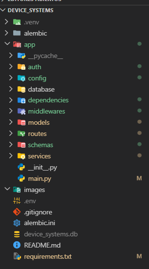

---

## 2. Captura de migración Alembic aplicada
En esta evidencia se muestra la aplicación de la migración con **Alembic**, confirmando la creación y actualización de la base de datos del proyecto.

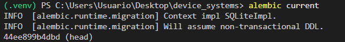

---

## 3. Captura del registro de usuario
A continuación se presenta la prueba del endpoint de registro de usuario, donde se realiza la creación correcta de un nuevo usuario en el sistema.

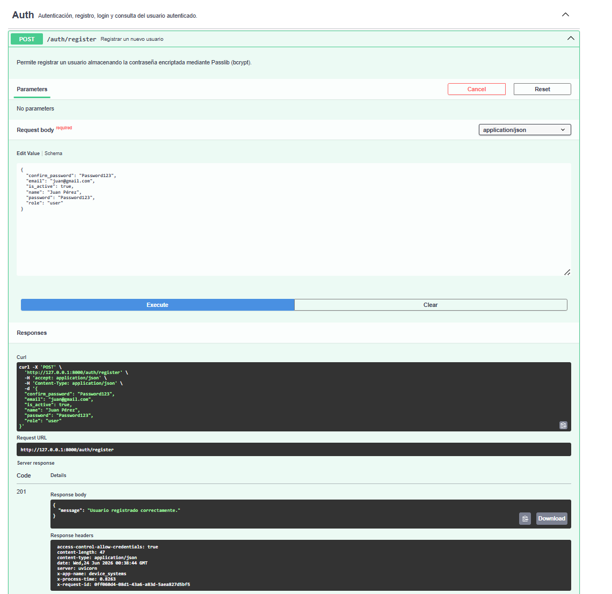

---

## 4. Captura del login y token generado
En esta sección se evidencia el proceso de autenticación del usuario y la generación del token de acceso.

### Login
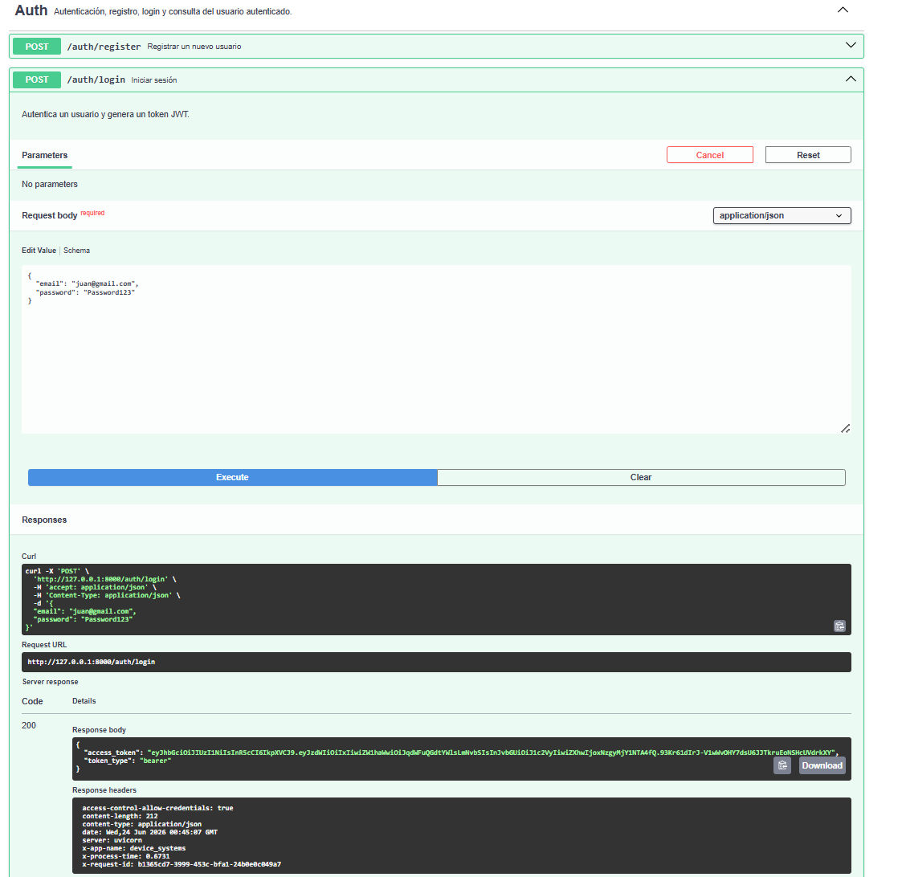

### Token generado
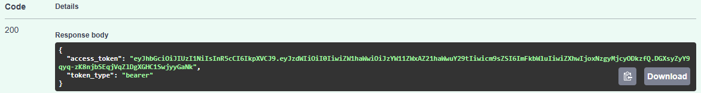

---

## 5. Captura de `/auth/me`
En esta evidencia se muestra el funcionamiento del endpoint `/auth/me`, el cual permite obtener la información del usuario autenticado mediante el token.

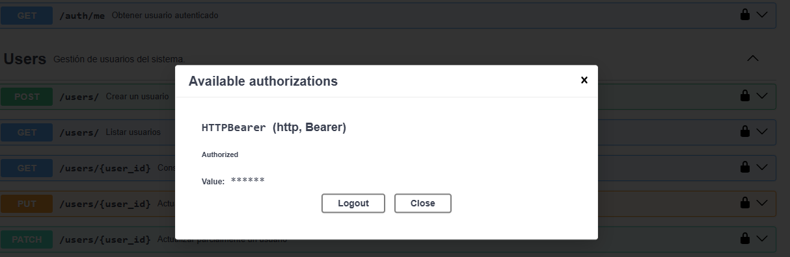

---

## 6. Captura de acceso sin token
La siguiente imagen demuestra el comportamiento del sistema cuando se intenta acceder a una ruta protegida sin enviar un token de autenticación.

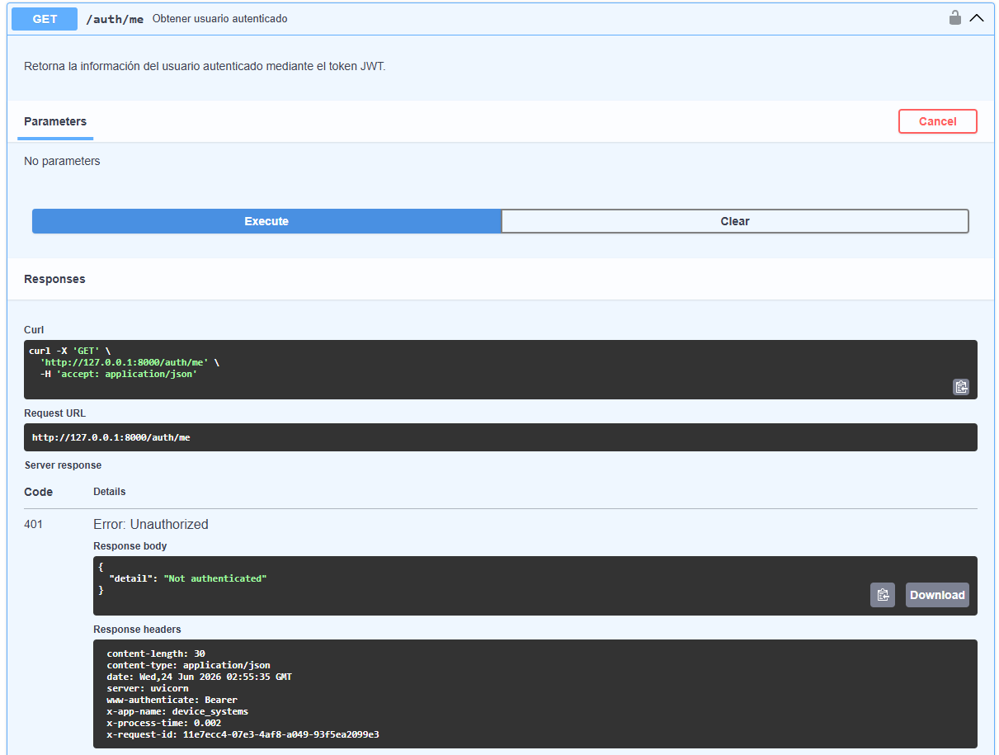

---

## 7. Captura de acceso con rol no permitido
En esta prueba se evidencia la restricción de acceso cuando un usuario intenta ingresar a una ruta para la cual no tiene permisos suficientes.

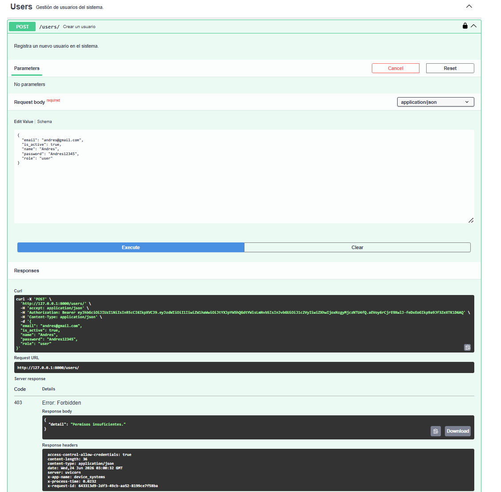

---

## 8. Captura de Swagger/OpenAPI con OAuth2
Aquí se muestra la documentación interactiva de la API mediante **Swagger/OpenAPI**, incluyendo la autenticación con **OAuth2** para probar los endpoints protegidos.

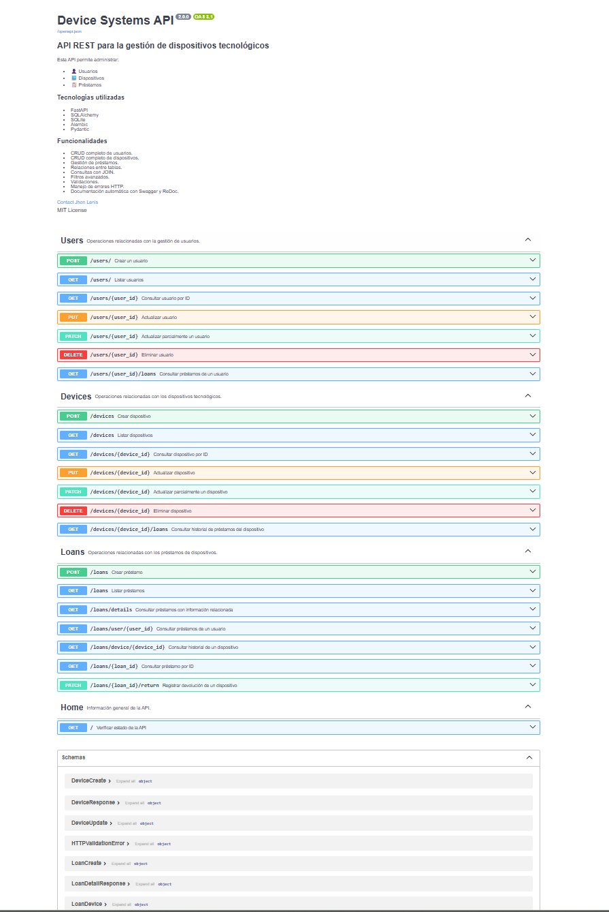

---

## 9. Captura de cabeceras del middleware
En esta evidencia se observan las cabeceras de seguridad agregadas por el middleware en las respuestas de la API.

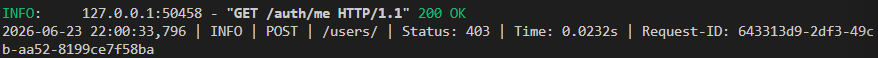

---

## 10. Captura de prueba de rate limiting
Esta imagen muestra la restricción de múltiples intentos de acceso en un periodo corto de tiempo, evidenciando el funcionamiento del **rate limiting**.

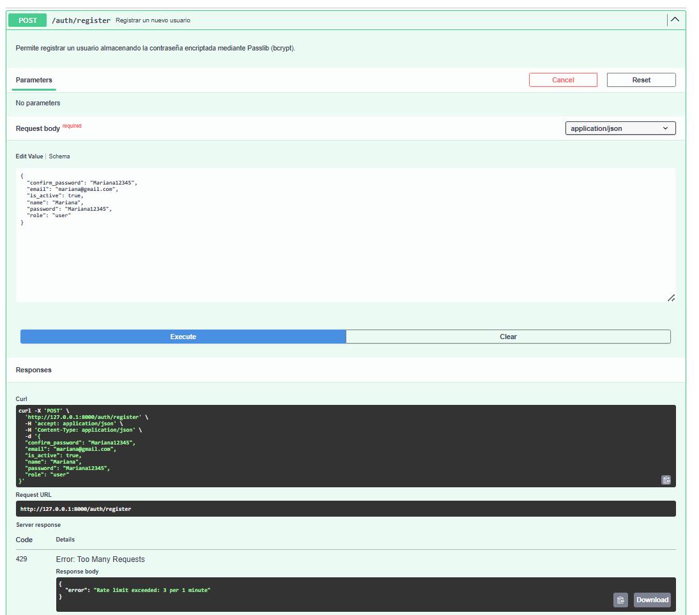

---

# Explicación de CORS configurado

CORS (**Cross-Origin Resource Sharing**) es un mecanismo de seguridad que permite controlar qué orígenes pueden acceder a los recursos de una API. Su configuración es importante porque ayuda a restringir accesos no autorizados desde otros dominios y permite definir qué métodos, cabeceras y credenciales están permitidos.

En este proyecto, CORS se configuró para controlar el acceso a la API y permitir únicamente las solicitudes necesarias, fortaleciendo así la seguridad del sistema.

## Ejemplo de configuración de CORS

```python
from fastapi.middleware.cors import CORSMiddleware

app.add_middleware(
    CORSMiddleware,
    allow_origins=["http://localhost:8000"],
    allow_credentials=True,
    allow_methods=["*"],
    allow_headers=["*"],
)
```

### Link del video

---

### Reflexión

La seguridad en las APIs REST es fundamental porque protege la información, controla quién puede acceder a los recursos y reduce riesgos como accesos no autorizados o abuso del sistema. Implementar autenticación, autorización, rate limiting, cabeceras seguras y una correcta configuración de CORS permite construir servicios más confiables y preparados para entornos reales.