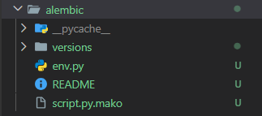
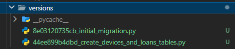
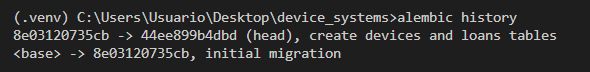
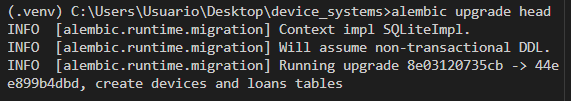
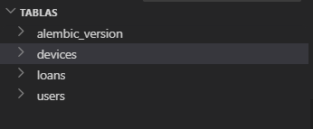
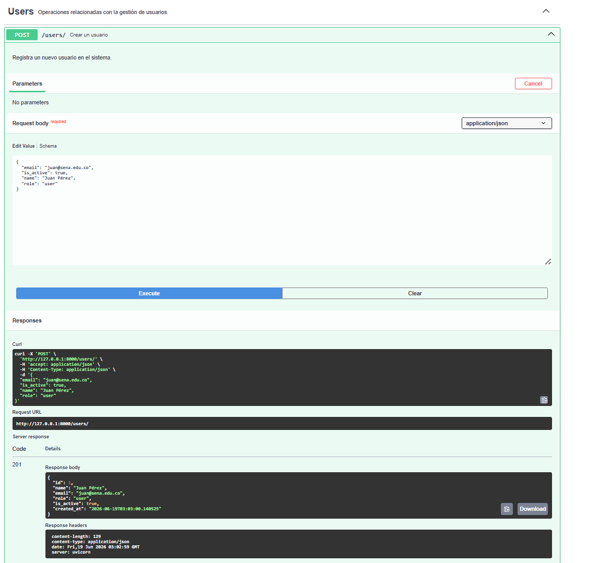
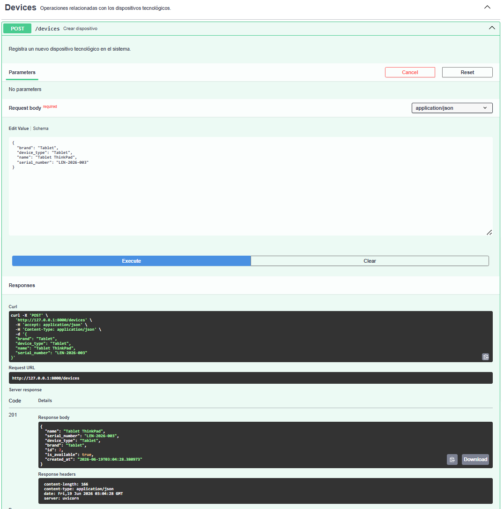
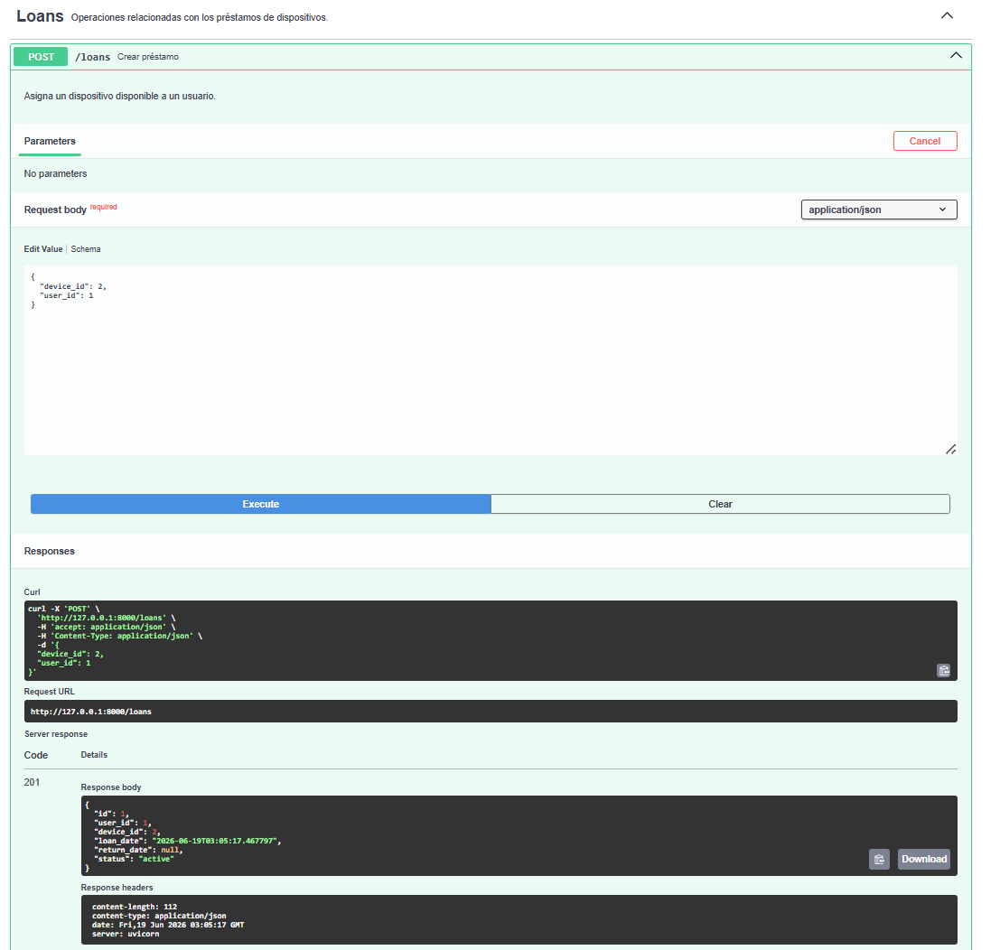
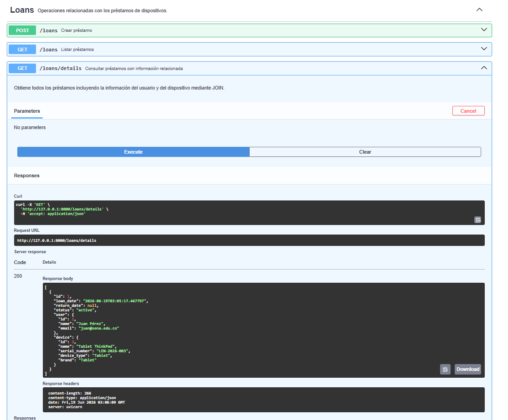
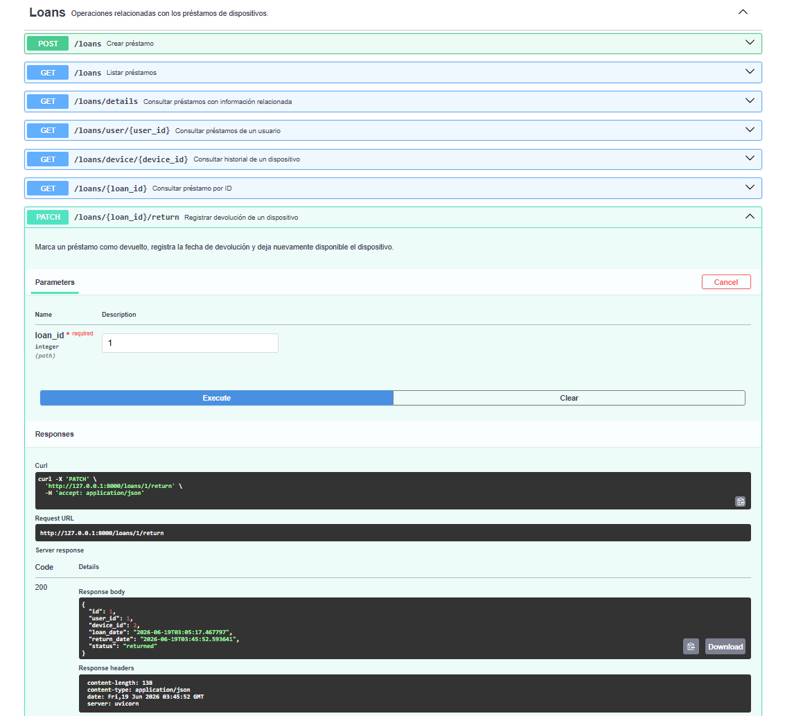

# Device Systems API

## Descripción

API desarrollada con FastAPI para la gestión de usuarios, dispositivos y préstamos de equipos tecnológicos. El proyecto implementa SQLAlchemy como ORM y Alembic para el control de migraciones de base de datos.

---

# Inicialización de Alembic

Se configuró Alembic para administrar las migraciones de la base de datos.

### Evidencia de ejecución de `alembic init`



---

# Creación de Migraciones

Se generó una migración automática a partir de los modelos definidos en SQLAlchemy utilizando el comando:

```bash
alembic revision --autogenerate -m "create devices and loans tables"
```

### Evidencia



### Carpeta de migraciones generadas



---

# Aplicación de Migraciones

Se aplicaron las migraciones pendientes a la base de datos mediante el comando:

```bash
alembic upgrade head
```

### Evidencia



---

# Estructura de Tablas Generadas

Después de ejecutar las migraciones, se generaron las tablas correspondientes en la base de datos:

- users
- devices
- loans
- alembic_version

### Evidencia



---

# Documentación Swagger UI

FastAPI genera automáticamente la documentación interactiva de la API mediante Swagger.

### Evidencia


---

# Creación de Usuario

Se realizó el registro de un nuevo usuario utilizando el endpoint correspondiente.

### Evidencia



---

# Registro de Dispositivo

Se registró un dispositivo en el sistema para posteriormente ser asignado mediante préstamos.

### Evidencia



---

# Creación de Préstamo

Se creó un préstamo asociando un usuario con un dispositivo disponible.

### Evidencia



---

# Consultas con JOINs

Se realizaron consultas utilizando JOINs para obtener información relacionada entre usuarios, dispositivos y préstamos.

### Evidencia



---

# Aplicación de Filtros

Se implementaron filtros para consultar información específica de los préstamos registrados.

### Evidencia


---

# Devolución de Dispositivo

Se realizó la devolución de un dispositivo prestado, actualizando automáticamente su estado de disponibilidad.

### Evidencia



---

# Link Video

https://youtu.be/mha6NZ3x2Y0

---

# Reflexión

El uso de Alembic para la gestión de migraciones permite mantener un control adecuado sobre la evolución de la estructura de la base de datos. Gracias a ello, los cambios realizados en los modelos pueden aplicarse de forma organizada y segura en diferentes entornos de trabajo.

Las relaciones entre entidades como usuarios, dispositivos y préstamos permiten representar situaciones reales de manera eficiente, garantizando la integridad de los datos y evitando inconsistencias.

Asimismo, las consultas avanzadas mediante JOINs y filtros facilitan la obtención de información relevante para la gestión del sistema, mejorando el rendimiento de las búsquedas y proporcionando resultados más precisos.

En conclusión, las migraciones, las relaciones entre tablas y las consultas avanzadas son componentes fundamentales para el desarrollo de aplicaciones robustas, escalables y fáciles de mantener.