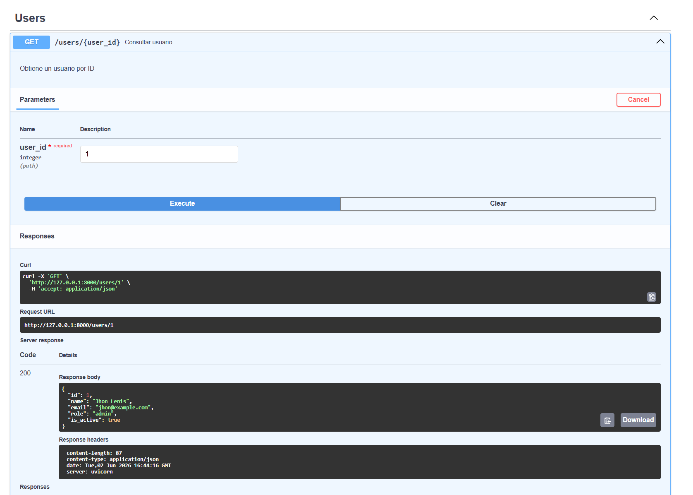
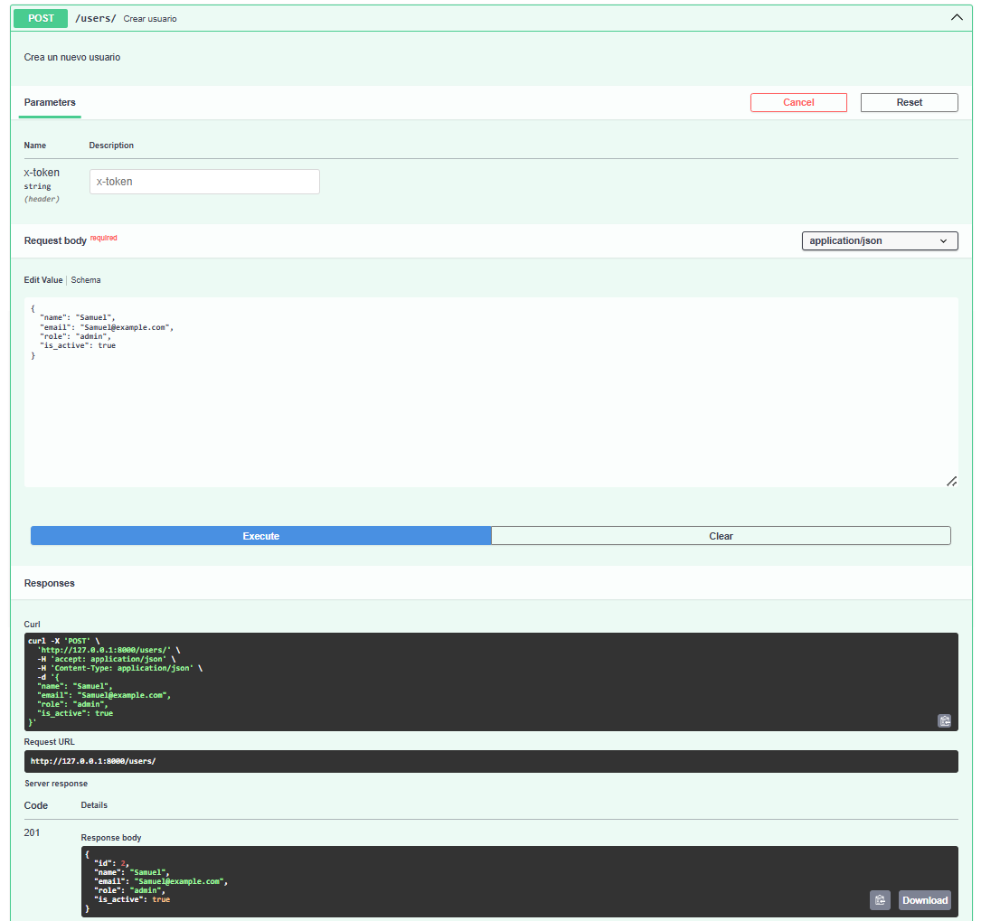
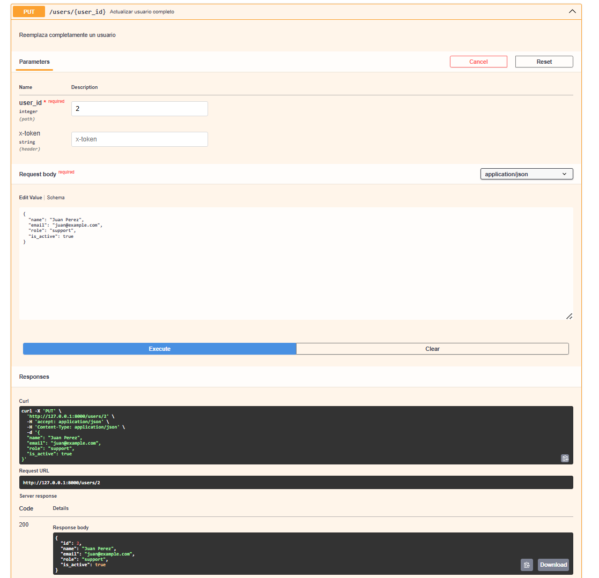
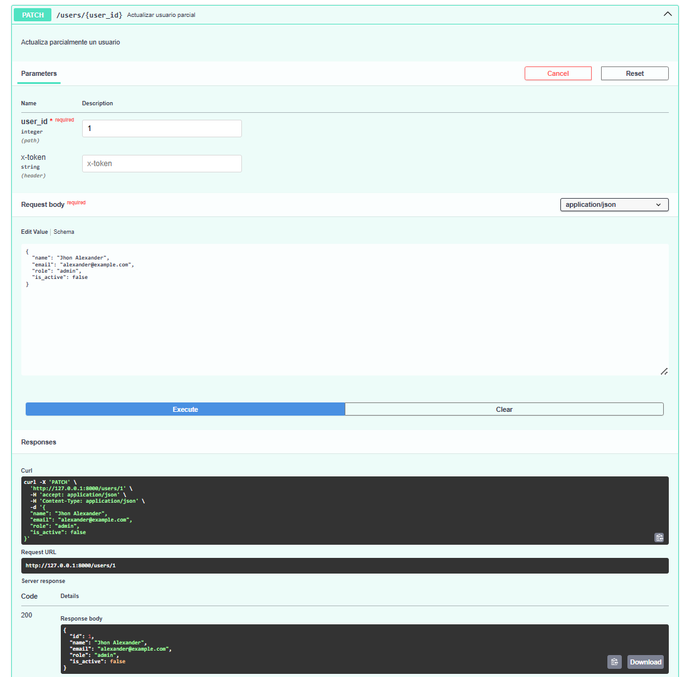
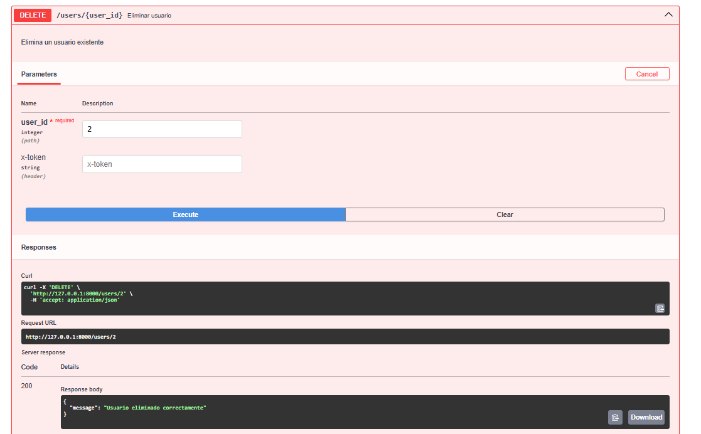

# device_systems

## Descripción

**device_systems** es una API REST desarrollada con FastAPI para la gestión de usuarios. Durante la evolución del proyecto se implementó un CRUD completo, manejo de errores mediante excepciones HTTP, documentación automática con Swagger y ReDoc, validación de datos con Pydantic y reutilización de lógica mediante Dependency Injection.

---

# Tecnologías Utilizadas

* Python 3
* FastAPI
* Uvicorn
* Pydantic
* Swagger UI
* ReDoc

---

# Estructura del Proyecto

```text
device_systems/
│
├── app/
│   ├── data/
│   │   └── users_db.py
│   │
│   ├── dependencies/
│   │   └── user_dependencies.py
│   │
│   ├── routes/
│   │   └── user_routes.py
│   │
│   ├── schemas/
│   │   └── user_schema.py
│   │
│   ├── services/
│   │   └── user_service.py
│   │
│   └── main.py
│
├── images/
│   ├── CrearUsuario.png
│   ├── EliminarUsuario.png
│   ├── IdBuscar.png
│   ├── PatchActualizar.png
│   └── PutActualizar.png
│
├── requirements.txt
└── README.md
```

## Explicación de la estructura

### app/routes

Contiene los endpoints de la API y define las rutas HTTP disponibles para los usuarios.

### app/services

Implementa la lógica de negocio relacionada con la gestión de usuarios.

### app/schemas

Contiene los modelos Pydantic utilizados para validar los datos de entrada y salida.

### app/dependencies

Incluye funciones reutilizables utilizadas mediante Dependency Injection.

### app/data

Simula una base de datos en memoria para almacenar usuarios.

### main.py

Punto de entrada principal de la aplicación FastAPI.

---

# Ejecución del Proyecto

## Instalar dependencias

```bash
pip install -r requirements.txt
```

## Ejecutar servidor

```bash
uvicorn app.main:app --reload
```

## Acceder a la documentación

Swagger UI:

```text
http://127.0.0.1:8000/docs
```

ReDoc:

```text
http://127.0.0.1:8000/redoc
```

---

# Capturas de Swagger UI

Agregar la captura tomada desde:

```text
http://127.0.0.1:8000/docs
```

```markdown

```

---

# Capturas de ReDoc

Agregar la captura tomada desde:

```text
http://127.0.0.1:8000/redoc
```

```markdown

```

---

# Evidencia de Pruebas de Endpoints

## GET /users/{user_id}

Consulta de usuario por identificador.



---

## POST /users

Creación de un nuevo usuario.



---

## PUT /users/{user_id}

Actualización completa de un usuario.



---

## PATCH /users/{user_id}

Actualización parcial de un usuario.



---

## DELETE /users/{user_id}

Eliminación de un usuario.



---

# Evidencia de Errores Controlados

La API implementa manejo de errores utilizando HTTPException.

## Usuario no encontrado

```json
{
  "detail": "Usuario no encontrado"
}
```

---

## Correo electrónico duplicado

```json
{
  "detail": "Correo electrónico duplicado"
}
```

---

## Rol no permitido

```json
{
  "detail": "Rol no permitido"
}
```

---

## Actualización sin datos

```json
{
  "detail": "Debe enviar al menos un campo para actualizar"
}
```

---

## Eliminación de usuario inexistente

```json
{
  "detail": "Usuario no encontrado"
}
```

---

# Dependency Injection con Depends()

Para reutilizar lógica común se implementó Dependency Injection mediante la función `Depends()` de FastAPI.

Ejemplo implementado:

```python
def get_user(user: dict = Depends(get_user_or_404)):
    return user
```

La dependencia `get_user_or_404()` busca un usuario por su identificador y, en caso de no existir, genera automáticamente una excepción HTTP 404.

Beneficios obtenidos:

* Reutilización de código.
* Menor duplicación de lógica.
* Mejor mantenimiento del proyecto.
* Mayor claridad en los endpoints.

---

# Endpoints Implementados

| Método | Endpoint         | Descripción              |
| ------ | ---------------- | ------------------------ |
| GET    | /users           | Listar usuarios          |
| GET    | /users/{user_id} | Consultar usuario por ID |
| POST   | /users           | Crear usuario            |
| PUT    | /users/{user_id} | Actualización completa   |
| PATCH  | /users/{user_id} | Actualización parcial    |
| DELETE | /users/{user_id} | Eliminar usuario         |

---

# Códigos de Estado HTTP Utilizados

| Código | Descripción           |
| ------ | --------------------- |
| 200    | Operación exitosa     |
| 201    | Recurso creado        |
| 400    | Solicitud incorrecta  |
| 404    | Recurso no encontrado |
| 422    | Error de validación   |

---

# Link del Video


---
# Reflexión Final

La evolución de la API device_systems permitió comprender cómo una aplicación REST básica puede transformarse en una solución más robusta y profesional mediante la incorporación de nuevos conceptos de FastAPI.

Durante el desarrollo se implementó el CRUD completo del recurso users, se fortaleció la validación de datos utilizando modelos Pydantic y se mejoró el manejo de errores mediante excepciones HTTP con respuestas claras para el cliente.

Asimismo, la utilización de Dependency Injection permitió reutilizar lógica común y reducir la duplicación de código, facilitando el mantenimiento y la escalabilidad del proyecto.

Finalmente, la integración de Swagger UI y ReDoc proporcionó una documentación automática y profesional de la API, facilitando las pruebas, el entendimiento de los endpoints y la experiencia de desarrollo.
